# Angular Inner Workings - Complete Guide

## Table of Contents
- [Angular Architecture Overview](#angular-architecture-overview)
- [File Structure Explained](#file-structure-explained)
- [How Angular Stitches Everything Together](#how-angular-stitches-everything-together)
- [RxJS and Observables](#rxjs-and-observables)
- [Component Lifecycle](#component-lifecycle)
- [Dependency Injection](#dependency-injection)
- [Data Flow Patterns](#data-flow-patterns)

---

## Angular Architecture Overview

Angular is a **component-based framework** that uses TypeScript and follows a modular architecture.

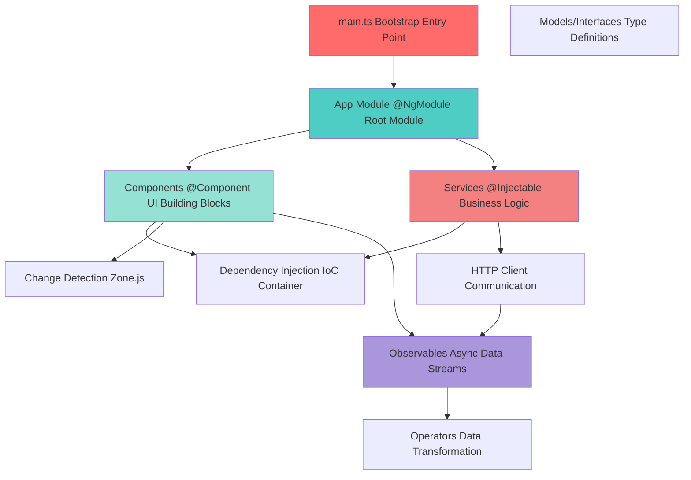

---

## File Structure Explained

Let's break down every file in your Angular project and understand **WHY** each one exists:

### 1. **`main.ts`** - The Entry Point

```typescript
import { platformBrowserDynamic } from '@angular/platform-browser-dynamic';
import { AppModule } from './app/app.module';

platformBrowserDynamic().bootstrapModule(AppModule)
  .catch(err => console.error(err));
```

**Why it's needed:**
- **The starting point** of your Angular application
- Tells Angular **which module** to bootstrap (load first)
- Uses `platformBrowserDynamic()` to compile the app in the browser
- Without this, Angular doesn't know where to start!

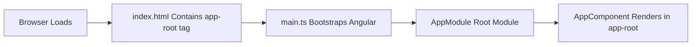

---

### 2. **`index.html`** - The HTML Shell

```html
<body>
  <app-root></app-root>  <!-- Angular inserts your app here -->
</body>
```

**Why it's needed:**
- The **single page** that loads in the browser
- Contains `<app-root>` where Angular injects your entire application
- Loads fonts, icons, and other external resources
- Angular is a **Single Page Application (SPA)** - this is that single page!

---

### 3. **`app.module.ts`** - The Root Module

```typescript
@NgModule({
  declarations: [AppComponent, TaskListComponent, TaskFormComponent],
  imports: [BrowserModule, HttpClientModule, MatToolbarModule],
  providers: [],
  bootstrap: [AppComponent]
})
export class AppModule { }
```

**Why it's needed:**
- **Declares** what components, directives, and pipes belong to this module
- **Imports** other modules (Angular built-in or custom)
- **Provides** services for dependency injection
- **Bootstraps** the root component
- Think of it as the **manifest** that tells Angular what your app contains

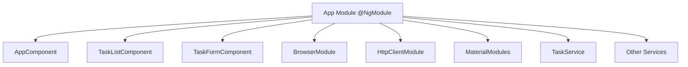

**Key Concepts:**
- **Declarations**: Components that belong to this module
- **Imports**: Other modules whose exported features are needed
- **Providers**: Services available for dependency injection
- **Bootstrap**: The root component to load first

---

### 4. **`app.component.ts`** - The Root Component

```typescript
@Component({
  selector: 'app-root',        // Matches <app-root> in index.html
  template: `<h1>Hello</h1>`,  // HTML template
  styles: [`h1 { color: blue }`] // Component styles
})
export class AppComponent {
  // Component logic
}
```

**Why it's needed:**
- The **first component** that Angular loads
- Acts as the **shell** or **layout** for your entire app
- Contains the toolbar, navigation, and child component outlets
- Think of it as the **master page** or **layout template**

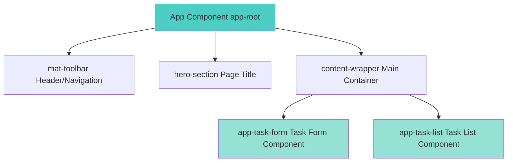

---

### 5. **Components** - Building Blocks

Your project has:
- `task-form.component.ts` - Creates tasks
- `task-list.component.ts` - Displays tasks

**Why components:**
- **Reusable** pieces of UI
- **Encapsulated** logic and styling
- **Composable** - build complex UIs from simple components
- **Maintainable** - each component has a single responsibility

```mermaid
graph LR
    Component[Component] --> Template[Template HTML]
    Component --> Class[Class TypeScript Logic]
    Component --> Styles[Styles CSS/SCSS]
    Component --> Metadata[@Component Decorator Configuration]
    
    Template --> DOM[Browser DOM]
    Class --> Data[Component State]
    Styles --> Rendering[Styled Output]
```

**Component Anatomy:**
```typescript
@Component({
  selector: 'app-task-form',     // How to use it in HTML
  template: `...`,                // The HTML
  styles: [`...`]                 // The CSS
})
export class TaskFormComponent {
  // Properties (state)
  taskForm: FormGroup;
  isSubmitting = false;
  
  // Constructor (dependencies)
  constructor(private taskService: TaskService) {}
  
  // Methods (behavior)
  onSubmit() { ... }
}
```

---

### 6. **`task.service.ts`** - Business Logic & HTTP

```typescript
@Injectable({
  providedIn: 'root'  // Available throughout the app
})
export class TaskService {
  private apiUrl = 'http://localhost:8080/api/tasks';
  
  constructor(private http: HttpClient) {}
  
  getAllTasks(): Observable<Task[]> {
    return this.http.get<Task[]>(this.apiUrl);
  }
}
```

**Why services:**
- **Separate concerns**: Keep components lean, move logic to services
- **Reusability**: Multiple components can use the same service
- **Testability**: Easier to test logic in isolation
- **Singleton pattern**: One instance shared across the app
- **HTTP communication**: Centralize API calls

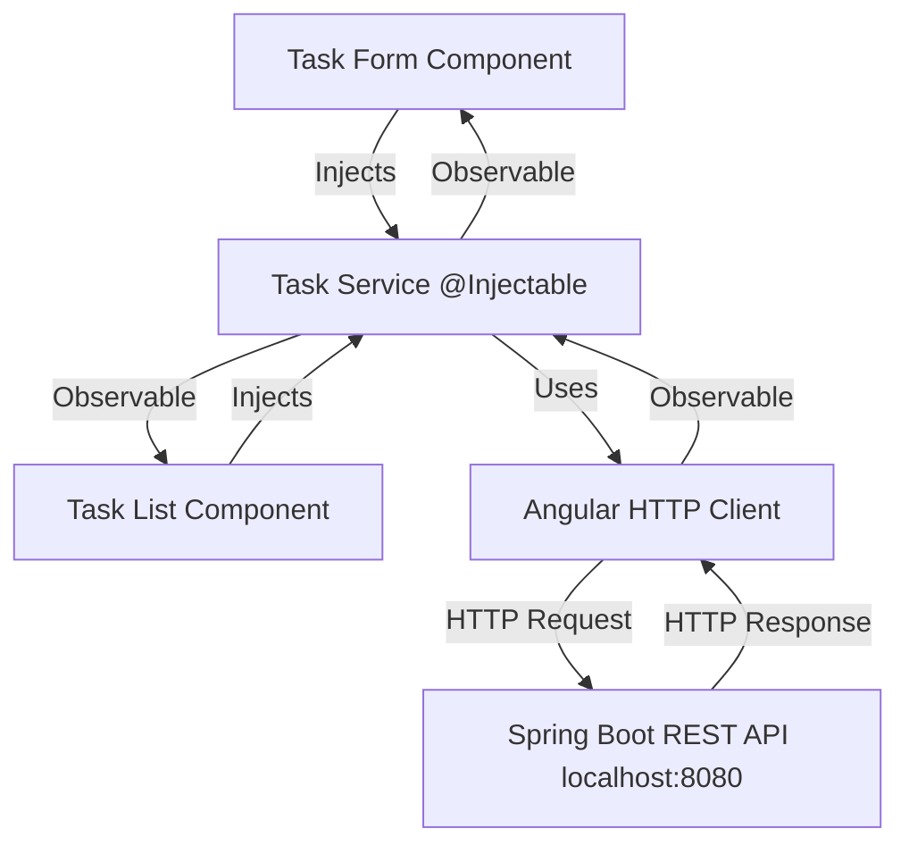

---

### 7. **`task.model.ts`** - Type Definitions

```typescript
export interface Task {
  id?: number;
  title: string;
  description: string;
  completed: boolean;
}
```

**Why models/interfaces:**
- **Type safety**: TypeScript catches errors at compile time
- **IntelliSense**: Get autocomplete in your IDE
- **Documentation**: Code is self-documenting
- **Contract**: Defines the shape of data
- **Refactoring**: Easier to change structure in one place

---

### 8. **`angular.json`** - Build Configuration

**Why it's needed:**
- Tells Angular CLI how to **build** your project
- Defines **file paths** for source, assets, styles
- Configures **build optimization** and **output directory**
- Sets up **dev server** options
- Without this, `ng serve` and `ng build` won't work!

---

### 9. **`package.json`** - Dependencies

**Why it's needed:**
- Lists all **npm packages** your project needs
- Defines **scripts** like `npm start`
- Specifies **versions** to ensure consistency
- Think of it as a **shopping list** for your project's dependencies

---

### 10. **`tsconfig.json`** - TypeScript Configuration

**Why it's needed:**
- Tells TypeScript **how to compile** your code
- Sets **compiler options** (target ES version, module system)
- Defines **strict type checking** rules
- Without this, TypeScript doesn't know how to process `.ts` files

---

## How Angular Stitches Everything Together

Let's trace a complete flow from user action to backend response:

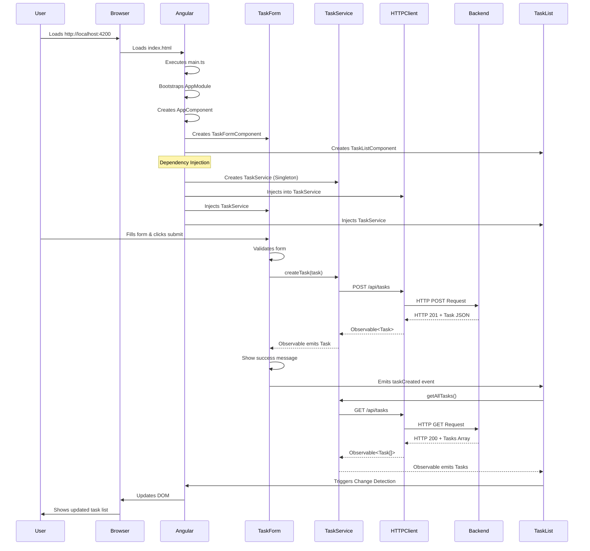

### Step-by-Step Breakdown:

**1. Application Bootstrap**
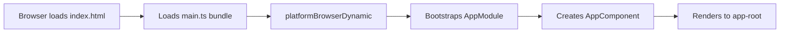

**2. Dependency Injection**
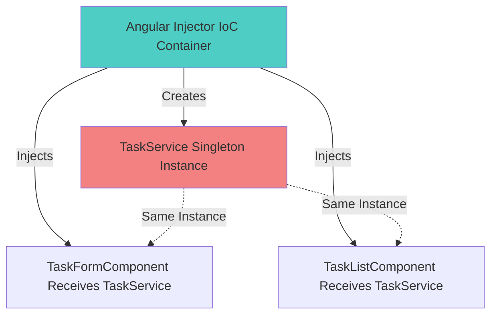

**3. Change Detection**
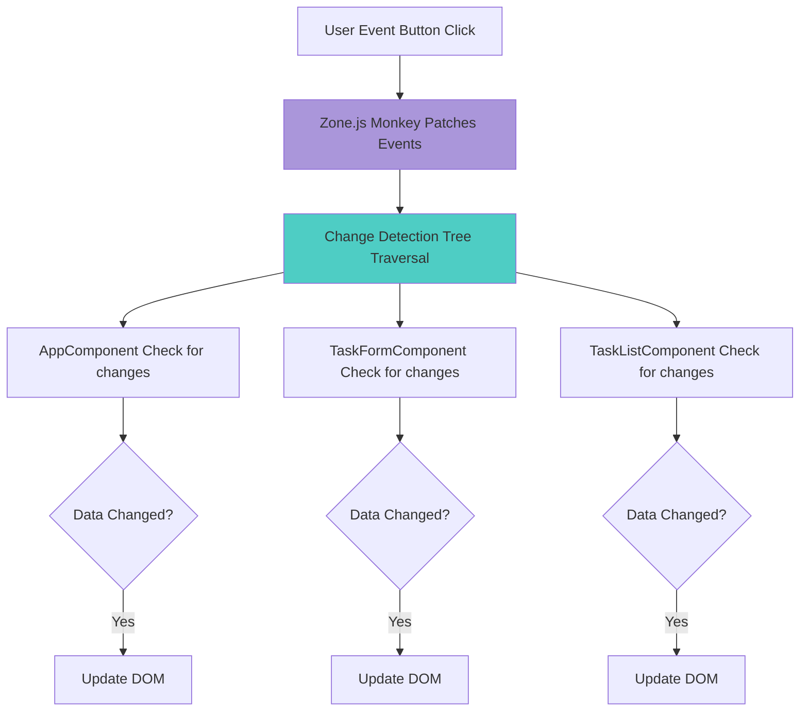

---

## RxJS and Observables

### Why RxJS is Required

RxJS is **not optional** in Angular - it's deeply integrated into the framework. Here's why:

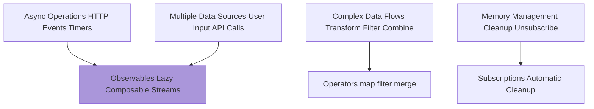

### Observable vs Promise

```typescript
// Promise - Single Value, Eager
const promise = fetch('/api/tasks');
promise.then(data => console.log(data));

// Observable - Multiple Values, Lazy
const observable$ = http.get('/api/tasks');
observable$.subscribe(data => console.log(data));
```

**Key Differences:**

| Feature | Promise | Observable |
|---------|---------|-----------|
| Values | Single | Multiple (stream) |
| Execution | Eager (immediate) | Lazy (on subscribe) |
| Cancellation | No | Yes (unsubscribe) |
| Operators | Limited (.then) | Rich (100+ operators) |
| Angular Integration | No | Yes |

### Observable Data Flow

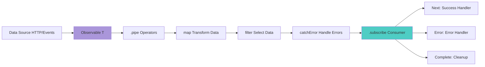

### Real Example from Your Code

```typescript
// In TaskService
getAllTasks(): Observable<Task[]> {
  return this.http.get<Task[]>(this.apiUrl);
  // Returns Observable - doesn't execute yet!
}

// In TaskListComponent
loadTasks() {
  this.taskService.getAllTasks()  // Still no HTTP call
    .pipe(
      // Operators transform the data
      map(tasks => tasks.filter(t => !t.completed)),
      catchError(error => {
        console.error('Error:', error);
        return of([]); // Return empty array on error
      })
    )
    .subscribe({
      next: (tasks) => {
        // NOW the HTTP call happens
        this.tasks = tasks;
        this.isLoading = false;
      },
      error: (error) => {
        // Handle errors
        this.showError('Failed to load tasks');
      }
    });
}
```

### Common RxJS Operators

```mermaid
graph TB
    map[map Transform each value]
    pluck[pluck Extract property]
    scan[scan Accumulate values]
    
    filter[filter Select values]
    take[take First N values]
    debounceTime[debounceTime Delay emissions]
    
    merge[merge Combine streams]
    combineLatest[combineLatest Latest from each]
    switchMap[switchMap Cancel previous]
    
    catchError[catchError Handle errors]
    retry[retry Retry on error]
```

**Your search functionality example:**
```typescript
searchControl.valueChanges  // Observable of user input
  .pipe(
    debounceTime(300),       // Wait 300ms after typing stops
    distinctUntilChanged(),  // Only if value changed
    switchMap(term =>        // Switch to new search, cancel old
      this.taskService.searchTasks(term)
    ),
    catchError(error => {    // Handle errors gracefully
      console.error(error);
      return of([]);
    })
  )
  .subscribe(results => {
    this.filteredTasks = results;
  });
```

### Why HttpClient Returns Observables

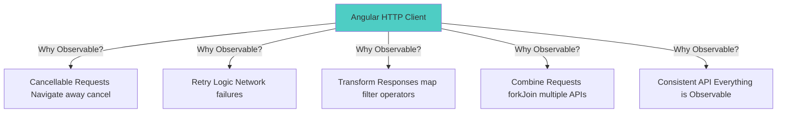

### Memory Leaks and Subscriptions

**Problem:**
```typescript
// BAD - Memory leak!
ngOnInit() {
  this.taskService.getAllTasks().subscribe(tasks => {
    this.tasks = tasks;
  });
  // Subscription never cleaned up!
}
```

**Solution 1: Unsubscribe manually**
```typescript
subscription: Subscription;

ngOnInit() {
  this.subscription = this.taskService.getAllTasks()
    .subscribe(tasks => this.tasks = tasks);
}

ngOnDestroy() {
  this.subscription.unsubscribe();  // Clean up!
}
```

**Solution 2: Use async pipe (recommended)**
```typescript
// Component
tasks$ = this.taskService.getAllTasks();

// Template
<div *ngFor="let task of tasks$ | async">
  {{ task.title }}
</div>
// Angular handles subscription automatically!
```

---

## Component Lifecycle

Angular components have a lifecycle from creation to destruction:

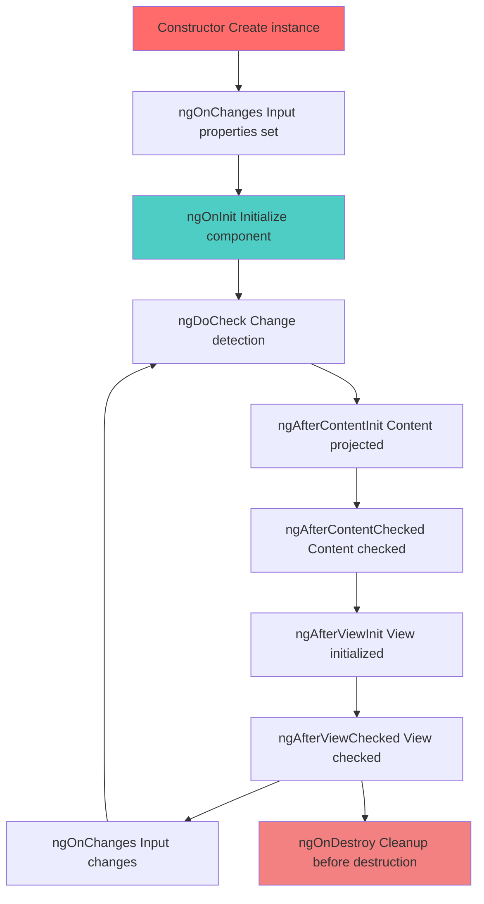

**When to use each hook:**

```typescript
export class TaskListComponent implements OnInit, OnDestroy {
  
  constructor(private taskService: TaskService) {
    // Dependency injection only
    // NO heavy logic here!
  }
  
  ngOnInit() {
    // Initialize component
    // Load data from API
    // Set up subscriptions
    this.loadTasks();
  }
  
  ngOnDestroy() {
    // Clean up subscriptions
    // Cancel pending requests
    // Remove event listeners
    this.subscription.unsubscribe();
  }
}
```

---

## Dependency Injection

Angular's DI system is like a smart waiter at a restaurant:

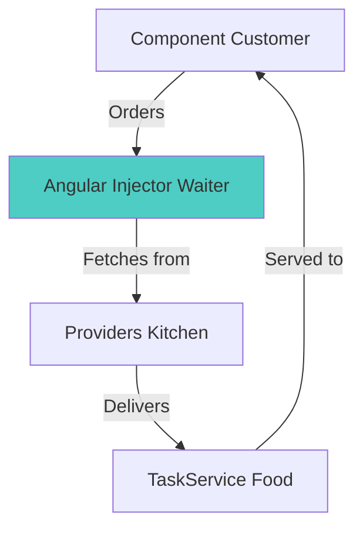

**How it works:**

```typescript
// 1. Service declares it's injectable
@Injectable({
  providedIn: 'root'  // Available app-wide
})
export class TaskService { }

// 2. Component requests the service
export class TaskFormComponent {
  constructor(private taskService: TaskService) {
    // Angular automatically provides TaskService
    // Component doesn't create it!
  }
}
```

**Dependency Injection Flow:**

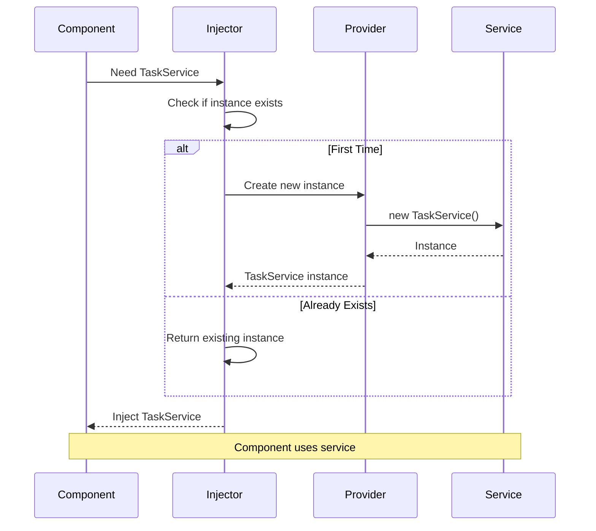

**Benefits:**
- **Loose coupling**: Components don't create dependencies
- **Testability**: Easy to mock services
- **Reusability**: Share single instance
- **Configuration**: Change implementation without changing component

---

## Data Flow Patterns

### Parent-Child Communication

```mermaid
graph TB
    Parent[AppComponent]
    Child1[TaskFormComponent]
    Child2[TaskListComponent]
    
    Parent -->|@Input Pass Data Down| Child1
    Parent -->|@Input Pass Data Down| Child2
    Child1 -->|@Output Emit Events Up| Parent
    Child2 -->|@Output Emit Events Up| Parent
    
    style Parent fill:#4ecdc4
    style Child1 fill:#95e1d3
    style Child2 fill:#95e1d3
```

**Example:**
```typescript
// Parent: app.component.ts
@Component({
  template: `
    <app-task-form (taskCreated)="onTaskCreated()">
    </app-task-form>
  `
})
export class AppComponent {
  @ViewChild('taskList') taskList!: TaskListComponent;
  
  onTaskCreated() {
    this.taskList.refreshTasks();  // Tell child to refresh
  }
}

// Child: task-form.component.ts
export class TaskFormComponent {
  @Output() taskCreated = new EventEmitter<void>();
  
  onSubmit() {
    this.taskService.createTask(task).subscribe(() => {
      this.taskCreated.emit();  // Notify parent
    });
  }
}
```

### Service-Based Communication

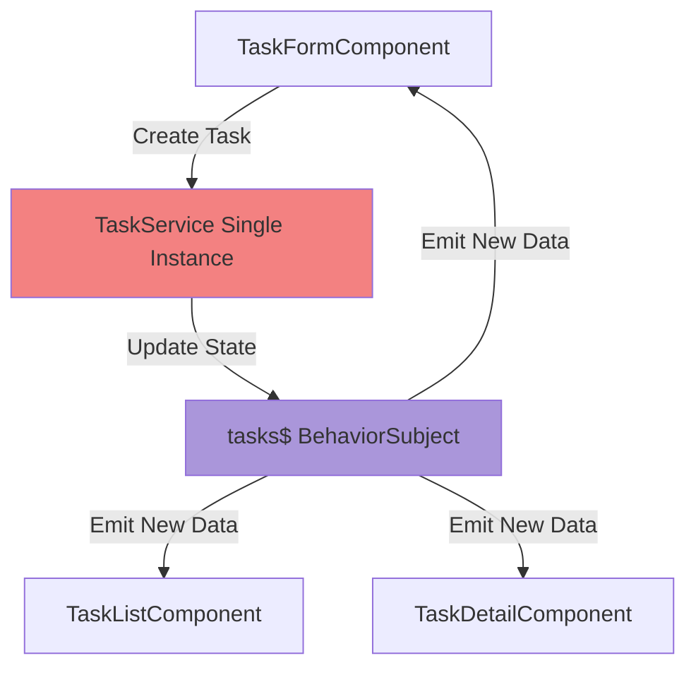

---

## Summary: How It All Works Together

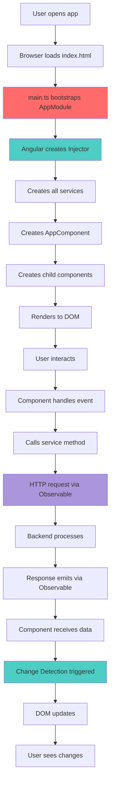

**Key Takeaways:**

1. **Everything starts with `main.ts`** → Bootstraps AppModule → Creates AppComponent
2. **Components are UI building blocks** → Template + Logic + Styles
3. **Services handle business logic** → Injected via DI, shared across components
4. **RxJS handles async operations** → Observables for HTTP, events, streams
5. **Change Detection updates the view** → Zone.js tracks events, Angular updates DOM
6. **Modules organize the application** → Import/Export features, lazy loading
7. **Dependency Injection manages instances** → Single source of truth, easy testing

---

**Last Updated**: February 7, 2026  
**Angular Version**: 17  
**Level**: Comprehensive Deep Dive
