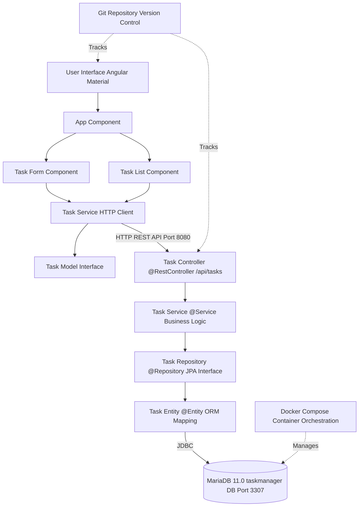
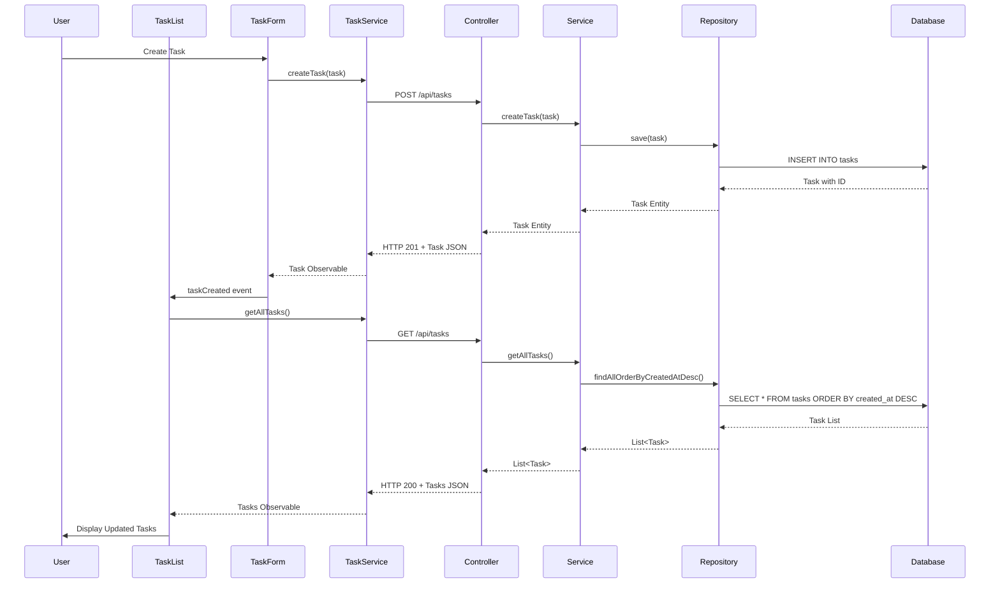
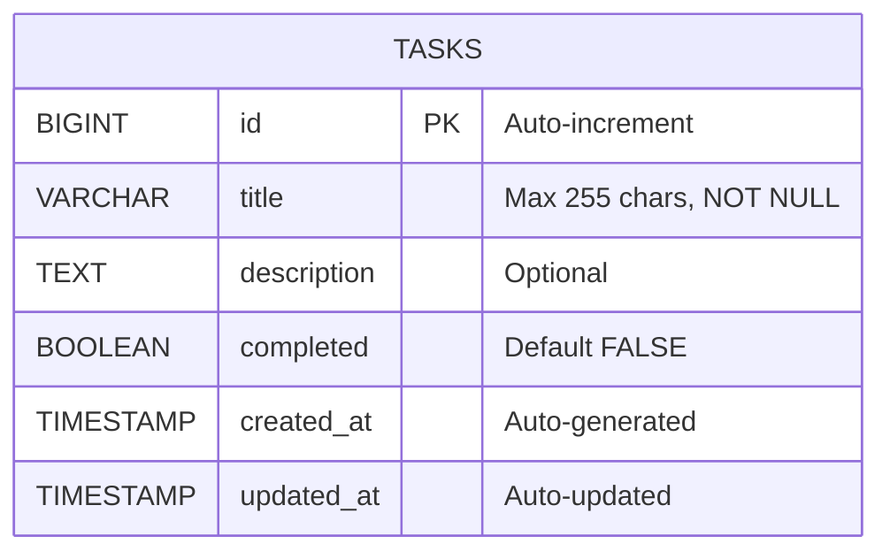
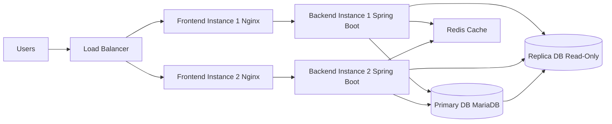

# Task Manager Application - Architecture

## System Architecture Diagram

## Component Flow

## Technology Stack

### Frontend
- **Framework**: Angular 17
- **UI Library**: Angular Material
- **Language**: TypeScript 5.2
- **State Management**: RxJS Observables
- **HTTP Client**: Angular HttpClient
- **Build Tool**: Angular CLI
- **Dev Server**: Port 4200

### Backend
- **Framework**: Spring Boot 2.7.18
- **Language**: Java 11
- **ORM**: Hibernate (JPA)
- **Database Driver**: MariaDB JDBC
- **Validation**: Bean Validation (javax.validation)
- **Build Tool**: Maven
- **Server**: Port 8080

### Database
- **DBMS**: MariaDB 11.0
- **Port**: 3307 (mapped from 3306)
- **Schema**: taskmanager
- **Tables**: tasks

### Infrastructure
- **Containerization**: Docker Compose
- **Version Control**: Git
- **Repository**: GitHub (itschuckg/taskmanager)

## API Endpoints

| Method | Endpoint | Description |
|--------|----------|-------------|
| GET | `/api/tasks` | Get all tasks (sorted by created_at DESC) |
| GET | `/api/tasks/{id}` | Get task by ID |
| GET | `/api/tasks/status/{completed}` | Get tasks by completion status |
| GET | `/api/tasks/search?keyword=` | Search tasks by title/description |
| POST | `/api/tasks` | Create new task |
| PUT | `/api/tasks/{id}` | Update existing task |
| PATCH | `/api/tasks/{id}/toggle` | Toggle task completion status |
| DELETE | `/api/tasks/{id}` | Delete task |

## Data Model

## Current Implementation Status

### ✅ Completed
- Angular frontend with full CRUD UI
- Spring Boot backend with REST API
- MariaDB database schema
- Docker Compose configuration
- Task entity with JPA mappings
- Service layer with business logic
- Repository with custom queries
- HTTP communication between frontend/backend
- Material UI components and styling
- Search and filter functionality

### ⚠️ Pending
- User authentication & authorization
- Global exception handling
- Input validation & sanitization
- Error handling in frontend
- Unit & integration tests
- API documentation (Swagger)
- Database migrations (Flyway/Liquibase)
- Pagination for task lists
- Environment-specific configurations
- Logging & monitoring setup

### 🔒 Security Concerns
- No authentication mechanism
- Hardcoded database credentials
- CORS configured for localhost only
- No rate limiting
- No input sanitization
- Plain text password storage in config files

## Deployment Architecture (Future)

---

**Last Updated**: February 7, 2026  
**Version**: 1.0.0  
**Status**: Development
